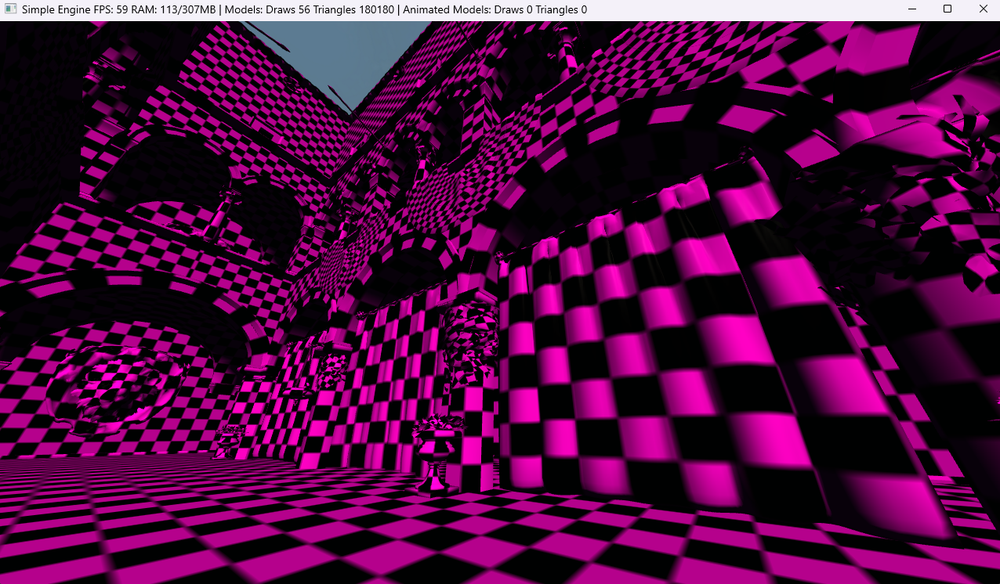
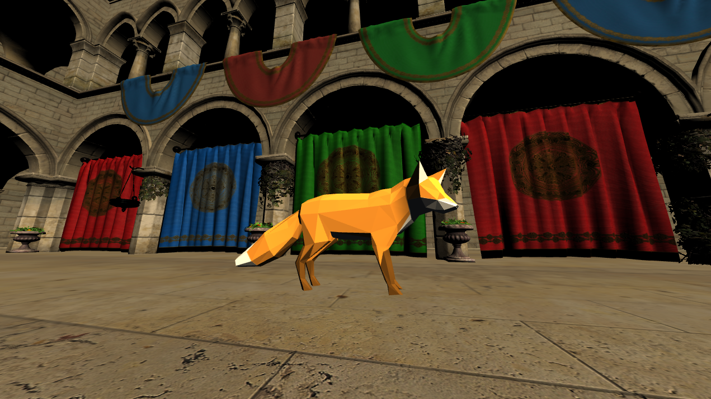
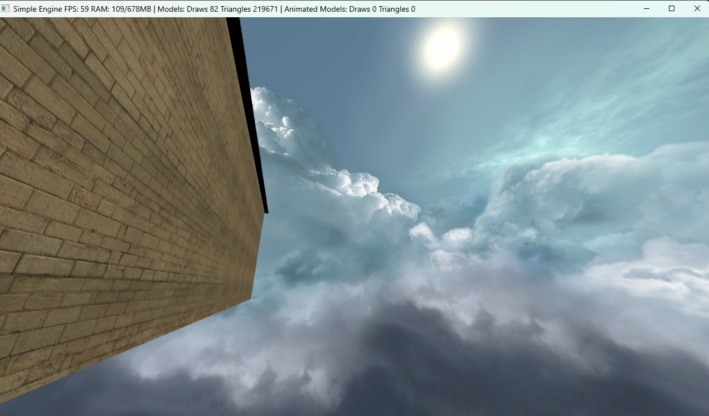
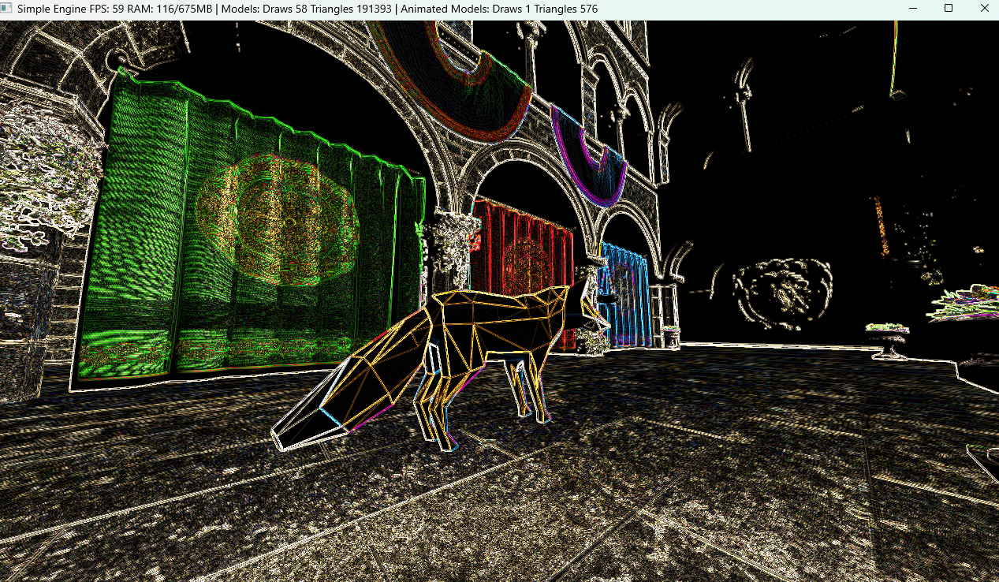
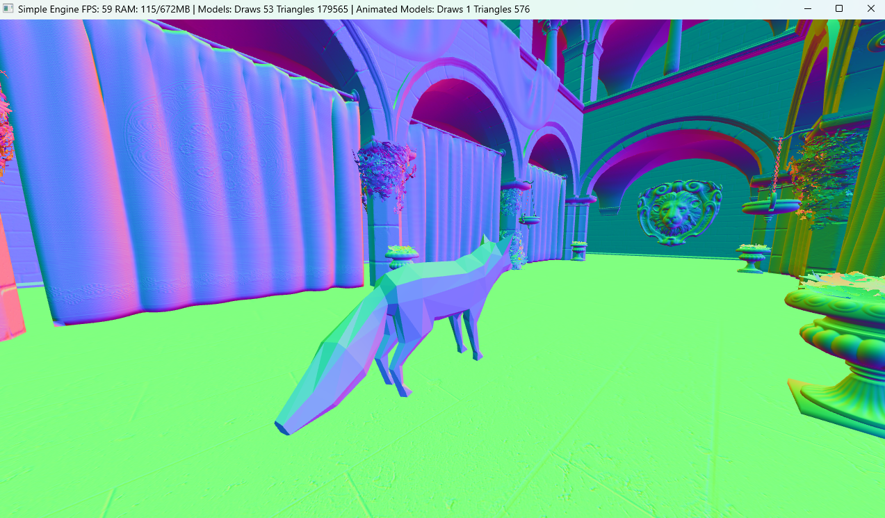
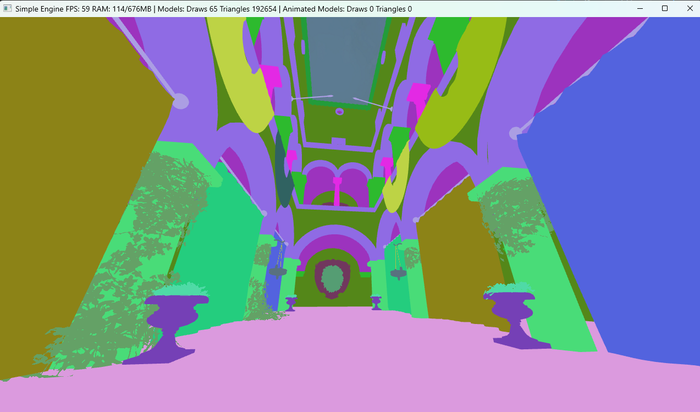
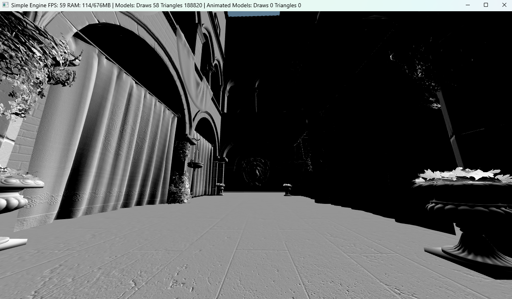
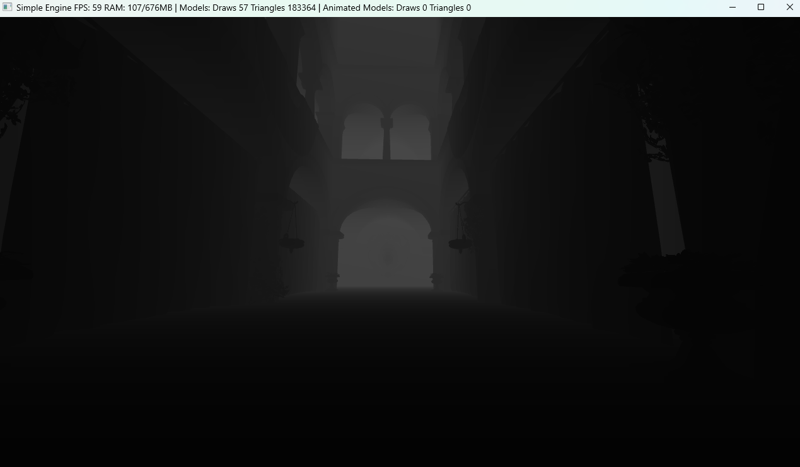

## Preface

After the last post, I finally started working on the voxel logic itself (which will be covered in the next post!). While doing so, I realized how tightly coupled some parts of the engine were, along with the limitations I would likely run into as the project grew.

At the same time, I inevitably fell into the rabbit hole of feature creep and refactoring, improving the engine along the way. At first, these were just small tweaks that I quietly folded into the previous post. Over time, however, the changes became much more substantial and deserved an update of their own. So, in this post, I'll go over those improvements.

## What's new in the engine

I won't cover every small refactor, bug fix, or minor improvement. While the devil is in the details, both the engine and the voxel system are still in their early stages and will likely evolve significantly over time, so these kinds of changes are to be expected.

Instead, let's go through the engine folder by folder and take a look at the structural changes and new features that were added along the way.

### Assets

#### New ownership model

Initially, the asset manager stored every asset using `std::shared_ptr`. Since assets are owned exclusively by the asset manager and referenced elsewhere through lightweight AssetHandles rather than shared ownership, I replaced `std::shared_ptr` with `std::unique_ptr`. This better reflects the ownership model, eliminates unnecessary reference counting overhead, and slightly improves performance.

#### Model loading

A few improvements were also made to make model loading more robust and consistent:

- **Default asset values.** Missing or incomplete resources now fall back to explicit default values. For example, missing textures are replaced with a **checkerboard texture**, while missing materials use a **default material**. This allows models to load gracefully instead of failing at runtime.
- **MikkTSpace tangent generation.** Tangent space is now generated automatically whenever a glTF asset does not provide tangents. This ensures normal maps behave consistently across different tools and allows assets without precomputed tangents to render correctly.

    

#### Animated models

Model loading was extended to support **animated glTF assets**, in addition to static geometry, materials, and textures.

Animation data in a glTF file is organized into three main elements:

- The **skeleton (skin)** defines a hierarchy of bones (nodes), along with inverse bind matrices used for skinning.
- **Animation clips** represent named animations (e.g. idle, walk, run), each grouping multiple animation channels.
- **Animation channels** store keyframe data over time, typically for translation, rotation, and scale of individual nodes (bones).

On import, the engine builds its own internal representation of this data. This allows animations to be evaluated at runtime by the **Animator**, which reconstructs poses from the imported keyframes.

> For a deeper explanation of skeletal animation, I recommend reading [this article](https://learnopengl.com/Guest-Articles/2020/Skeletal-Animation).

#### Cubemaps support

I also implemented cubemap support from scratch. In my previous engine, textures and cubemaps were unified under a single texture asset, which introduced a lot of conditional logic and made the system harder to maintain.

A **Cubemap asset** is responsible for loading the six faces, validating them, and creating the GPU cubemap texture.

Rendering is handled independently by **SkyboxRenderer**, which draws a unit cube directly on the GPU (no imported mesh or CPU geometry), removes translation from the view matrix so the skybox stays centered on the camera, and samples the cubemap in the fragment shader to simulate an infinitely distant environment.

### Core

#### New config file format

The config file parsing was changed from **INI** to **TOML**, thus switching from [simpleini](https://github.com/brofield/simpleini) to [toml++](https://github.com/marzer/tomlplusplus). 

I found that with the first I was maintaining a lot of code just to parse the **INI** file. After looking at **toml++**, I found it to be a more modern and flexible format, and its API just clicked with me more.

#### New update loop

I moved away from updating everything directly in the application loop. The application is now responsible only for platform-level concerns such as windowing, event polling, timing, and frame orchestration, while simulation is handled in **Level**.

**Level** acts as a simulation coordinator for the game world. It orchestrates the update of the scene, gameplay systems, and related simulation logic, using a player-intent-based input model to decouple simulation from direct input devices.

> The update loop now uses a more robust fixed timestep approach for handling delta time, based on the approach described in [Fix Your Timestep](https://gafferongames.com/post/fix_your_timestep/).

### Render

#### Decoupling scene from renderer

An important architectural improvement in the engine was decoupling the scene from the renderer by introducing a transformation layer. Scene objects are no longer directly consumed by rendering systems; instead, they are converted into rendering-specific data structures that describe what should be rendered, not how it should be rendered.

#### Rendering pipeline refactor

The rendering pipeline underwent a significant refactor, particularly around transparency handling and the render queue system. This redesign was driven by both the integration of animation as well as research into more scalable transparency techniques.

Geometry is first classified during submission based on its material and animation state. Each renderable is assigned to one of four internal paths: **static opaque**, **opaque animated**, **static transparent**, or **transparent animated**.

Transparent geometry is further split based on the material's transparency mode. **CPU-sorted transparency** renders objects back-to-front after a depth sort, which works well for simple scenes but becomes expensive with many transparent objects and cannot correctly handle intersecting geometry. **Order Independent Transparency (OIT)** instead uses accumulation and revealage buffers, avoiding sorting at the cost of a more complex GPU pass.

> For more information on **OIT**, I recommend reading [this article](https://learnopengl.com/Guest-Articles/2020/OIT/Introduction).

**Animated geometry** bypasses batching and is always submitted per-draw-call, but follows the same transparent or opaque classification depending on its material state.

The render queue reflects this structure directly, separating **static opaque batches**, **opaque animated draws**, and two transparent pipelines (**sorted** and **OIT**). This allows static geometry to remain highly batchable while still supporting animated and transparent rendering paths where needed.

#### Framebuffer and post-processing

I also introduced framebuffer support into the engine, enabling more advanced rendering techniques such as **OIT accumulation**, **MSAA**, and **post-processing effects**.

In my previous engine, full-screen post-processing effects were implemented using a screen-aligned quad. Here, I switched to using a full-screen triangle, a more efficient and modern approach in OpenGL.

This removes the need for vertex buffers dedicated to screen geometry and guarantees full-screen coverage without the edge artifacts that can occur with quad-based rendering.

> A detailed discussion of the full-screen triangle technique can be found [here](https://stackoverflow.com/questions/2588875/whats-the-best-way-to-draw-a-fullscreen-quad-in-opengl-3-2/51625078) and an in-depth performance analysis [here](https://wallisc.github.io/rendering/2021/04/18/Fullscreen-Pass.html).

> A few debugging views were also added to visualize framebuffer contents directly, helping to inspect post-processing passes and debug rendering artifacts.

<table>
  <tr>
    <td align="center">
       
      <em>Normals view</em>
    </td>
    <td align="center">
       
      <em>Material IDs view</em>
    </td>
  </tr>
  <tr>
    <td align="center">
       
      <em>NDOTL (normal dot light) view</em>
    </td>
    <td align="center">
       
      <em>Linear Depth view</em>
    </td>
  </tr>
</table>

#### Lighting system

The lighting shader was refactored to support a variable number of lights instead of a fixed limit, improving scalability with scene complexity. I also introduced a hybrid approach combining **Blinn-Phong** with **PBR-style metallic-roughness inputs**.

> This system is still a work in progress, and I plan to continue refining it in the future. In particular, I may explore more scalable approaches such as deferred rendering for scenes with many lights. For the voxel renderer, alternative strategies such as **flood lighting** or other specialized techniques may be more appropriate.

### Scene

#### First-person camera and Visibility Mask

The initial camera implementation was changed to support **first-person movement** by using a **visibility mask** to exclude the player mesh from rendering. The idea of using masks/layers to filter objects in a scene is something I borrowed from Godot, and I found it to be a very flexible approach.

This mechanism also generalizes well beyond the player case. It can be used to exclude UI or particles from specific render passes, or to filter objects for effects such as water reflections and shadow maps.

I also improved the **third-person camera**, shifting it from a fixed offset approach to an orbit-style camera. This provides more flexible and controllable camera movement around the player.

> The **third-person camera** does not currently handle collision detection, so it can still clip through walls. A physics-aware camera will likely be added later, especially once more complex environments such as caves are introduced.

#### Animation system

At runtime, each animated entity owns an **Animator** and an **AnimationController**. The **AnimationController** is a small locomotion state machine that selects which animation should play (e.g., idle, walk, or run), while the **Animator** handles the actual animation evaluation and pose reconstruction.

During each update, the **Animator** advances the animation time, samples keyframes for each animated bone, and optionally blends between two poses during transitions. From this, it builds the final bone palette, which is then uploaded to the GPU. The vertex shader performs skinning using these matrices to produce the final animated mesh.

#### Player class evolution

The **Player** is no longer just a camera controller with basic movement. It has evolved into a central gameplay object handling input, movement, animation, and camera state. This includes **first- and third-person modes**, a visible animated body instance, and optional root motion, where movement can be driven either by input or directly by animation data.

To support this, its responsibilities were split into dedicated systems:
**CharacterController:** handles movement and facing logic
**AnimationController:** selects locomotion animations and manages animation state
**CameraController:** manages first and third-person camera behavior independently from the Player

## Conclusion

After reading (*hopefully*) all of this, you might be wondering why I've been implementing ideas from the README and previous posts, since I've admittedly drifted a bit from the main objective of developing a voxel world.

When working on engine features that are *not strictly voxel-related* (and will be covered in future posts), some are generic enough to belong in most engines, whether voxel-based or traditional 2D/3D. Systems such as **audio**, **UI**, and **particles** fall into this category, and will be implemented at some point regardless.

As mentioned earlier, others such as **lighting** are more specific to voxel engines and often require completely different approaches.

Similarly, **sky** is not always based on **cubemaps**, and can instead use **procedural** or **gradient-based** approaches, which I plan to explore in the voxel engine.

Finally, systems such as **animation** and **post-processing** sit somewhere in between. While not *voxel-specific*, they were added earlier to support longer-term goals, such as animated world elements and a more flexible rendering pipeline for future features like shadows and advanced effects.

Let's close this post here. In the next one, I'll shift focus back to the voxel engine itself and the progress made so far, returning to the main objective of this blog.