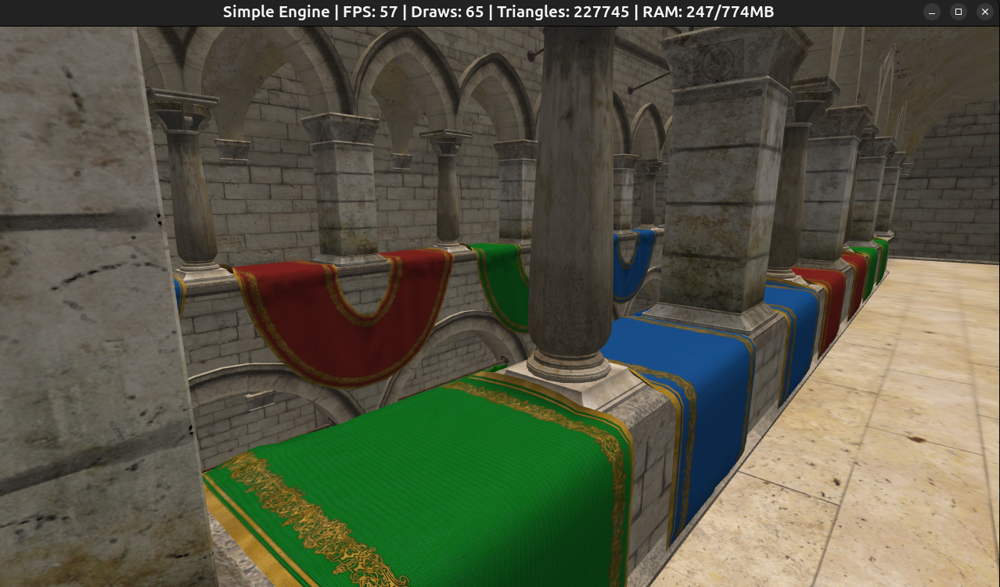
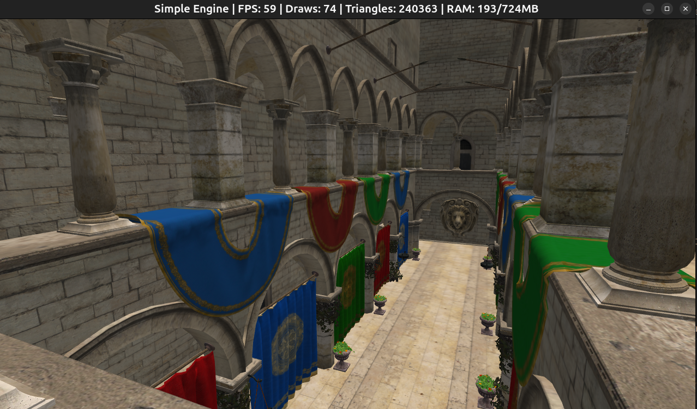

## Preface

Well... it probably wasn’t entirely accurate to say in the first post that I wouldn’t use an engine. It would have been more precise to say that I wouldn’t use a complex engine, or that the engine itself wouldn’t be the priority.

Once I actually started the project, I realized that I needed something to handle the basics: window management, rendering, asset loading, and so on. Otherwise, the engine code would have ended up mixed together with the voxel code in a spaghetti mess, making it harder for anyone reading the code (or this blog) to understand what does what, and much harder to expand the project in the future.

Therefore, I decided to write an engine as simple as possible while still being reasonably efficient and following good design practices.

The engine itself can serve as a template for other projects and be modified as needed. The repository can be found at [simpleengine](https://github.com/kafkaphoenix/simpleengine) and the repository for the voxel project (using the engine as the starting template) is at [voxeljourney](https://github.com/kafkaphoenix/voxeljourney).

## Engine overview

The engine is written in C++23, with OpenGL 4.6 for rendering and GLFW for window and input management. To handle dependencies and build the project, it uses [CMake](https://cmake.org/), [Makefile](https://www.gnu.org/software/make/manual/make.html), and [Vcpkg](https://vcpkg.io/en/). Linting is done with [Clang-Tidy](https://clang.llvm.org/extra/clang-tidy/) and formatting with [Clang-Format](https://clang.llvm.org/docs/ClangFormat.html).

The design goals of the engine are to be simple, efficient, and easy to understand. I avoided including systems like audio, physics, debugging tools, scripting, UI, etc., as I wanted only the minimum to start with voxels and expand it as needed.

## Engine architecture

The engine is divided into four modules: **Core**, **Render**, **Assets**, and **Scene**. Each module is responsible for a specific aspect of the engine's functionality, and they interact with each other to run the game.

### Core

This the central part of the engine. It is responsible for initializing and shutting down the different subsystems and maintaining the game loop. It also includes window management, input, events, configuration, and level loading.

> "A game loop runs continuously during gameplay. Each turn of the loop, also called a Frame, it processes user input without blocking, updates the game state, and renders the scene. It tracks the passage of time to control the rate of gameplay." [Game Loop](https://gameprogrammingpatterns.com/game-loop.html)

The configuration file **config.ini** is read at startup to load various runtime options such as the application name, window resolution, mouse options, movement speed, or to change existing ones without recompiling the project.

**Level** coordinates the scene and the renderer. It is responsible for updating the scene and submitting the Renderables to the renderer each frame, handles the camera and lighting information that is sent to the renderer and is also responsible for passing the configuration, the input and the events to the scene and its entities, so they can react accordingly. Alongside loading the scene using the SceneBuilder.

> In a more complex engine, the level is just one state inside a bigger state machine that controls the whole game flow. It handles things like switching between the main menu, gameplay, pause, etc., making sure everything transitions smoothly and behaves consistently.

**Stats** are collected each frame: triangles, draw calls, FPS, RAM usage, and are displayed in the window title for easy monitoring of performance.

### Assets

The asset system is responsible for loading and managing the game's resources, such as shaders, textures, models, and materials. Having one is important in order to avoid loading the same resources multiple times and to facilitate their management (loading and unloading) in the lifecycle of the project.

All assets derive from the base Asset interface, so new ones can be easily added. They are stored in an unordered_map using a [UUID](https://en.wikipedia.org/wiki/Universally_unique_identifier) as the key and a shared_ptr to the asset as the value. 

When accessed, they are returned as an AssetHandle, which is a lightweight, type-safe reference. This way, the code that uses the assets does not have to worry about memory management or concrete types; it simply uses the handle to access them. If the asset is not loaded or changes, the asset manager automatically loads it and caches it for future references.

Types of assets:
- **Shader**: Loads the shader source code from a file, compiles it, and links it into a shader program that can be used to draw Renderables. Currently, it only supports simple shaders with vertex and fragment shaders, but it could be expanded to support geometry shaders, compute shaders, etc.
- **Texture**: Creates an OpenGL texture ID and configures it with the appropriate parameters for use in the shader. Currently, it only supports 2D textures, but it could be expanded to support cubemaps, texture arrays, etc. It automatically generates mipmaps (to reduce aliasing and improve performance at a distance) and applies Anisotropic filtering (to improve texture quality at oblique angles,avoiding the [Moiré effect](https://en.wikipedia.org/wiki/Moir%C3%A9_pattern)).
- **Model**: Loads the model's geometry into a Mesh and the associated textures and shaders into a Material. Currently, it only supports static models, but it could be expanded to support animations.
- **Material**: Maintains a reference to a shader and its associated textures, as well as the render state, such as whether it is transparent or not, or the color if there are no textures.

### Scene

This module contains the data structures and logic for the scene and its entities. It is responsible for creating and updating the entities in the scene, as well as handling their interactions and behaviors.

- **SceneBuilder** is responsible for loading the scene data, for the example it just loads a simple scene with a sky, a sun and the sponza model.

- **Camera** is a component that defines the view and projection matrices for rendering the scene. It is attached to the player and follows its position and rotation.

- **Player** is responsible for controlling the camera and movement. For now, it has no physics or interaction logic, it just moves through the scene and looks around without a visible 3D model.

- **Light** is a component that defines the properties of a light source, such as its type (directional, point, spot), color, intensity, and direction. For the example, it only uses a directional light (the sun) and an ambient light.

- **Renderables** refers to the objects that can be rendered in the scene. They are created by combining a Mesh, a Material, and a Transform. The Renderable is what is submitted to the renderer each frame to be drawn on the screen.

### Render

The render manager is responsible for drawing the scene to the screen; otherwise, we would just see an empty window.

> The goal of this post is not to explain in detail how OpenGL works; for that, I highly recommend [LearnOpenGL](https://learnopengl.com/). However, I want to give a general idea of how the rendering logic is structured, so I will explain it at a high level and leave that tutorial for those who want to delve into the details.

The rendering workflow is as follows:
- When the frame begins, the render manager is cleared and prepared to receive the Renderables for that frame. It calculates the frustum planes based on the camera's view/projection matrix, which will be used for frustum culling later.
- During the update phase of the scene, the render manager receives the Renderables from the scene and prepares them for drawing sending them to the different renderers. For now, there is only one renderer, the model renderer, but in the future, there could be more specialized renderers (water, particles, voxels, etc.) that handle specific types of Renderables with different rendering techniques.
- The model renderer submits the Renderables to the event queue, which will be processed at the end of the frame.
- At the end of the frame, the render manager calls once again the renderers to process the event queue and draw the Renderables.
- The model renderer groups the renderables by Mesh and Material to minimize GPU state changes (CPU batching), sort them by opaques and transparents, and then uses instanced rendering to draw multiple copies of the same geometry with different transforms and materials, filtering out the ones that are not visible using frustum culling.

> This way, instead of making a draw call for each Renderable, hundreds or thousands can be drawn with a single call, depending on the configured batch size, which significantly improves performance.

> We can imagine, for example, a field of grass, where each blade of grass is a Renderable with the same geometry and material but with different positions and rotations. Instead of making a draw call for each blade, they can all be drawn with a single call using instanced rendering.

This type of rendering is called forward renderer with instancing. It is well suited for simple scenes with a limited number of lights, which is the case for this project. Additionally, it is easier to implement and understand compared to more advanced rasterization techniques such as forward+, deferred rendering, or clustered rendering.

Another fundamentally different approach is ray tracing, which does not rely on rasterization. Instead, it simulates the physical behavior of light by tracing rays as they interact with objects in the scene.

> For a good explanation of the diferent rendering techniques, I recommend this [blog](https://c0de517e.blogspot.com/2016/08/the-real-time-rendering-continuum.html) by Angelo Pesce.

The model renderer also has a Frame UBO (Uniform Buffer Object) to send common data that affects all Renderables, such as the camera's view/projection matrix or light information (Sun or ambient light). This allows the shader to access this information without needing to send it each time a Renderable is drawn, which improves performance and simplifies the shader.

> Another optimization I implemented is calculating the model and normal matrix on the CPU, which avoids having to do it in the shader for each vertex, which can be costly in terms of performance, especially if there are many vertices.

## Conclusion
So well, that's all for today's post! I hope this gives you a good overview of the engine's architecture and design goals. Feel free to explore the [code repository](https://github.com/kafkaphoenix/simpleengine) and ask any questions you may have.

Let's wrap up with a screenshot of the engine rendering the **Sponza** model, a classic 3D scene commonly used for testing rendering techniques. Tested on an i7 laptop without a dedicated GPU.

<table>
  <tr>
    <td align="center">
       
      <em>Sponza GLTF, loads in ~5 seconds</em>
    </td>
    <td align="center">
       
      <em>Sponza GLB, loads in ~3 seconds</em>
    </td>
  </tr>
</table>

In the next post, I will start working on the voxel engine itself, so stay tuned!